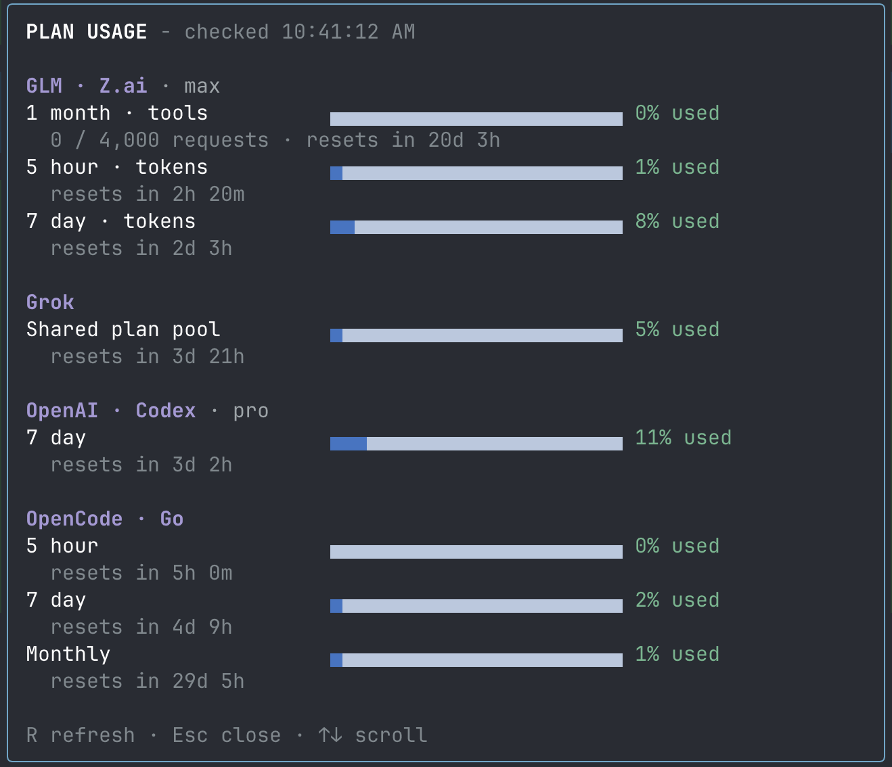

# Pi Plan Usage

A small, read-only **`/usage`** modal for **GLM/Z.ai, Grok, OpenAI Codex, and OpenCode Go**. Shows provider-reported plan consumption, progress bars, reset countdowns, and checked time—not local token/cost estimates.



## Install and update

Install globally for your Pi sessions, tracking the repository's default branch:

```sh
pi install git:github.com/steve-goldberg/pi-usage

# Pull updates later:
pi update --extensions
```

For a pinned release instead:

```sh
pi install git:github.com/steve-goldberg/pi-usage@v0.4
```

Tags are pinned: `pi update --extensions` will not move `@v0.4` to a newer release. Remove the pinned source before switching to the unpinned installation. Add `--local` to install for only the current project.

Run `/reload` after installation or updates, then **`/usage`**. Avoid loading both a local checkout and the GitHub package: they are different package sources and can register duplicate `/usage` commands. Disable any other extension registering `/usage` too.

## Use

Thick bars show **used capacity in darker blue** and **unused capacity in light grey-blue**. Small nonzero usage gets at least one filled cell; the percentage is authoritative. Percentage labels retain warning colors at 70% and error colors at 90%. The header shows the oldest available provider snapshot time inline: `PLAN USAGE - checked …`.

- **R** refresh (60-second cooldown within an open modal)
- **↑/↓**, **j/k**, **Page Up/Down**, **Home/End** scroll
- **Escape**, **Enter**, or **q** close and cancel requests

One command, no credential-entry controls, skills, footer replacement, startup polling, or session-history scanning. Requires the interactive terminal, not RPC/print mode. Tested with Pi **0.87.1**.

## Authentication and coverage

Uses `ctx.modelRegistry.getProviderAuth(provider)`. Pi manages credentials and OAuth refresh. No separate credential storage, Keychain access, auth-file access, browser cookies, or external coding CLI invocation.

| Display | Pi provider ID | Required auth | Usage source |
|---|---|---|---|
| GLM | `zai` | Z.ai coding-plan API key | Z.ai quota monitor |
| Grok | `xai` | Grok subscription OAuth | Grok CLI credits billing API |
| OpenAI | `openai-codex` | ChatGPT/Codex OAuth | ChatGPT usage API |
| OpenCode Go | `opencode-go` | OpenCode API key with Go subscription | OpenCode Go usage API |

All four have been verified live using this machine's Pi auth. OpenCode Go reports rolling (5-hour), weekly and monthly percentages and reset times; no dollar limits or plan tier are inferred. It uses only `opencode-go` auth, with no fallback to another provider or browser cookies. Custom aliases/proxies, header-only auth, regional GLM services, ordinary OpenAI API billing, and xAI management/team billing are not supported.

Only reported windows appear. Codex may omit a 5-hour window; providers may return percentages without absolute token/credit limits. No limits are inferred from model context size or local token counts. Grok's shared pool can include usage outside coding/Pi. Paid extra usage is labeled separately. An absent percentage is **not reported**, never zero.

Claude integration and its dedicated saved token have been removed at the user's request. Use Claude Code for its usage. This extension does not access or change Claude Code credentials.

## Privacy and request behavior

- One parallel read-only query per provider on open; successful providers render independently.
- 12-second per-provider deadline covering auth resolution, headers and body. Closing cancels HTTP requests. Pi's own auth refresh may finish independently because its registry API has no signal parameter.
- Fixed HTTPS endpoints; redirects rejected. No credential logs, raw-response mode, telemetry, quota-reset consumption, or persistent usage cache.
- Results are snapshots; reopen or refresh to update. No automatic polling.
- HTTP 429 means rate-limited, **not valid or invalid credentials**. The modal shows the provider's `Retry-After`, or an explicitly labeled five-minute local backoff. That provider's requests are blocked across dashboard opens until the deadline. This state is in-memory within the extension runtime, not shared across processes or preserved after `/reload`.
- Provider errors, missing auth and unknown schemas remain explicit. Endpoints can change without notice.

## Releases

- **v0.4** — Compact header with inline checked time; removed redundant descriptions.
- **v0.3** — Thicker, high-contrast blue usage bars; visible small nonzero usage.
- **v0.2** — OpenCode Go usage support alongside GLM, Grok and Codex.
- **v0.1** — Initial `/usage` dashboard.

## Development

From a local checkout (disable any globally installed copy first):

```sh
# Try for one Pi invocation:
pi -e ./src/index.ts

# Or install this checkout for this project:
pi install --local .

npm install
npm test
npm run typecheck

# Explicit live checks; Pi may refresh its own OAuth credentials:
npm run check:live
python3 scripts/smoke-tui.py
```

Node 22.6+ is needed for test scripts' TypeScript stripping (tested on Node 26.9.0). Pi packages are peer dependencies; no additional runtime dependencies. This machine's development peers are linked to installed Pi; normal `npm install` resolves them on another checkout.

`check:live` prints normalized usage only. `smoke-tui.py` tests isolated Pi processes in regular/fullscreen modes with other extensions disabled, in-memory sessions, live bars, resize, scroll and dismissal. It submits no model prompts.

[RESEARCH.md](RESEARCH.md) records historical third-party extension assessments. [VALIDATION.md](VALIDATION.md) describes the current verification scope.
